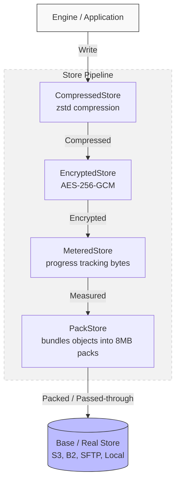

# Cloudstic — Flat Cloud Backup Specification

## Version

* Specification version: 2.0
* Date: 2026-02-21

---

## Overview

Cloudstic is a content-addressable backup system designed for flat cloud storage (Google Drive, OneDrive, S3, SFTP, local filesystem). It supports:

* **Checkpoint-only snapshots** — every snapshot is a complete view, no delta replay needed
* **Structural sharing** via a Merkle-HAMT — only changed paths are re-uploaded
* **Content deduplication** via content-defined chunking (FastCDC)
* **Immutable, content-addressed objects** — every object is keyed by its hash (HMAC-SHA256 for chunks, SHA-256 for metadata)
* **Multi-parent and duplicate-name file support** (Google Drive semantics)

---

## Architecture

### Sources (read-only data origins)

| Source            | Flag                      | Description                                      |
|-------------------|---------------------------|--------------------------------------------------|
| `local`           | `-source local`           | Local filesystem directory                       |
| `sftp`            | `-source sftp`            | Remote SFTP server                               |
| `gdrive`          | `-source gdrive`          | Google Drive full scan via OAuth2                 |
| `gdrive-changes`  | `-source gdrive-changes`  | Google Drive incremental via Changes API          |
| `onedrive`        | `-source onedrive`        | Microsoft OneDrive full scan via OAuth2           |
| `onedrive-changes`| `-source onedrive-changes`| Microsoft OneDrive incremental via delta API      |

### Stores (content-addressed object storage)

| Store   | Flag            | Description                     |
|---------|-----------------|---------------------------------|
| `local` | `-store local`  | Local directory (`./backup_store` by default) |
| `s3`    | `-store s3`     | Amazon S3 (or S3-compatible service) |
| `b2`    | `-store b2`     | Backblaze B2 bucket             |
| `sftp`  | `-store sftp`   | Remote SFTP server              |

### Store Pipeline (Chaining)

Cloudstic implements storage via a decorator pattern (store chaining). When the application writes or reads an object, the request passes through a layered sequence of wrapper stores before reaching the persistent backing store.



The pipeline from outermost (application layer) to innermost (network layer) is:

1. **Compressed Store**: Compresses outgoing objects using `zstd` and decompresses incoming objects.
2. **Encrypted Store** *(optional)*: Encrypts the compressed data using AES-256-GCM, and decrypts/authenticates the ciphertext on read.
3. **Metered Store**: Tracks bytes written to and read from the underlying layer to precisely report progress reflecting the actual physical bytes stored/retrieved.
4. **Pack Store** *(optional)*: Intercepts small objects (like `filemeta/`, `node/`, and small manifests). Buffers them in memory and groups them into 8MB pack files (`packs/<hash>`) to drastically reduce bucket API requests and billing. Large objects bypass the buffer and pass through directly.
5. **Base / Real Store**: The raw persistent backend (e.g., `s3`, `local`, `sftp`). This layer performs the exact I/O or network requests.

**Data Flow Example (Read):**

`App ← [decompress] ← [decrypt] ← [measure] ← [extract from pack or get] ← [Base Store]`

### Commands

| Command            | Description                                              |
|--------------------|----------------------------------------------------------|
| `init`             | Initialize a new repository with encryption key slots    |
| `backup`           | Scan a source, upload changed files, create a snapshot   |
| `restore`          | Export a snapshot's file tree as a ZIP archive            |
| `list`             | Print a table of all snapshots                           |
| `ls`               | Print the file tree of a specific snapshot               |
| `diff`             | Compare two snapshots and show file-level changes        |
| `forget`           | Remove a snapshot (and optionally prune afterwards)      |
| `prune`            | Mark-and-sweep garbage collection of unreachable objects |
| `break-lock`       | Force-remove a stale repository lock                     |
| `key list`         | List all encryption key slots in the repository          |
| `key passwd`       | Change (rotate) the repository password                  |
| `key add-recovery` | Add a BIP39 recovery key slot to the repository          |

---

## Object Types

All objects are stored under a flat key namespace of the form `<type>/<hash>`.

### 1. Chunk

* Raw file data, zstd-compressed.
* Object key: `chunk/<hmac_sha256>` (HMAC-SHA256 keyed by the dedup key when
  encryption is enabled, plain SHA-256 otherwise)
* **Format:** Raw binary (zstd stream). Not JSON-wrapped.
* Produced by **FastCDC** content-defined chunking:

| Parameter | Value    |
|-----------|----------|
| Min size  | 512 KiB  |
| Avg size  | 1 MiB    |
| Max size  | 8 MiB    |

* The final chunk of a file may be smaller than the minimum.
* Deduplicated by hash of the original uncompressed data (HMAC-keyed when
  encrypted, preventing the storage provider from confirming file contents).

### 2. Content

* References the ordered list of chunks that make up a file's content.
* Object key: `content/<sha256-of-raw-file-content>`

```json
{
  "type": "content",
  "size": 10485760,
  "chunks": [
    "chunk/<sha256>",
    "chunk/<sha256>"
  ]
}
```

* `data_inline_b64` (optional): base64-encoded bytes for very small files, in place of `chunks`.

### 3. File Metadata (FileMeta)

* Immutable metadata about a file or folder.
* Object key: `filemeta/<sha256-of-serialized-json>`

```json
{
  "version": 1,
  "fileId": "abc123",
  "name": "invoice.pdf",
  "type": "file",
  "parents": ["filemeta/<sha256>"],
  "paths": [],
  "content_hash": "<sha256-of-raw-file-content>",
  "size": 21733,
  "mtime": 1710000000,
  "owner": "user@example.com",
  "extra": { "mimeType": "application/pdf" }
}
```

| Field          | Description                                                         |
|----------------|---------------------------------------------------------------------|
| `fileId`       | Source-specific unique identifier (Google Drive ID, relative path)   |
| `type`         | `"file"` or `"folder"`                                              |
| `parents`      | List of `filemeta/<sha256>` refs pointing to parent metadata objects |
| `content_hash` | SHA-256 of the raw file content (used to key the Content object)    |
| `paths`        | Reserved for future use (multi-path support)                        |
| `extra`        | Source-specific metadata (e.g. MIME type)                           |

* `fileId` is **the HAMT key**.
* Folders have an empty `content_hash` and `size` of 0.
* Deduplicated by SHA-256 of the canonical JSON representation.

### 4. HAMT Node

Merkle-HAMT nodes map file IDs to their `filemeta/<sha256>` references.

Object key: `node/<sha256-of-serialized-json>`

#### Internal Node

```json
{
  "type": "internal",
  "bitmap": 2348810305,
  "children": ["node/<sha256>", "node/<sha256>"]
}
```

* 5 bits consumed per level → 32-way branching.
* `bitmap` encodes which child slots are populated (popcount-compressed).

#### Leaf Node

```json
{
  "type": "leaf",
  "entries": [
    { "key": "<fileId>", "filemeta": "filemeta/<sha256>" }
  ]
}
```

* Maximum 32 entries per leaf.
* Entries are sorted by key for deterministic hashing.

### 5. Snapshot

* A complete checkpoint pointing to a HAMT root.
* Object key: `snapshot/<sha256-of-serialized-json>`

```json
{
  "version": 1,
  "created": "2025-12-01T12:00:00Z",
  "root": "node/<sha256>",
  "seq": 42,
  "source": {
    "type": "gdrive",
    "account": "user@gmail.com",
    "path": "my-drive://"
  },
  "meta": {
    "generator": "cloudstic-cli"
  },
  "tags": ["daily", "important"],
  "change_token": "12345",
  "exclude_hash": "d4c3b2a1..."
}
```

| Field          | Description                                                          |
|----------------|----------------------------------------------------------------------|
| `seq`          | Monotonically increasing sequence number                             |
| `source`       | Origin of the backup (type, account, path) — used for retention grouping |
| `meta`         | Free-form key-value metadata (generator, etc.)                       |
| `tags`         | User-defined labels for retention policies                           |
| `change_token` | Opaque token for incremental sources (omitted when not applicable)   |
| `exclude_hash` | SHA-256 of the concatenated exclude patterns used for this snapshot  |

* Every snapshot is a **complete checkpoint** — no delta replay needed.
* Structural sharing via the HAMT minimises the number of new nodes.

#### Change tokens

Incremental sources (`gdrive-changes`) record an opaque `change_token` in each snapshot. On the next backup, the engine reads the token from the previous snapshot and passes it to the source, which returns only the files that changed since that token. If no previous token exists (first backup or after switching from a full-scan source), the source performs a full scan and saves the initial token.

The token format is source-specific:

| Source              | Token type                                    |
|---------------------|-----------------------------------------------|
| `gdrive-changes`    | Google Drive Changes API start page token     |
| `onedrive-changes`  | Microsoft OneDrive delta API next-link/token  |

### 6. Packfiles (`packs/` and `index/packs`)

To avoid issuing hundreds of thousands of S3 `PUT` and `GET` requests for tiny metadata objects, the storage layer implements a stateless PackStore.

* All small objects (< 512KB) like `filemeta/`, `node/`, and small `content/` objects are buffered in memory and flushed as aggregated 8MB `packs/<hash>` files.
* The `index/packs` catalog is then updated to record the exact byte offset and length of each logical object within its packfile.
* When reading, the entire 8MB packfile is fetched and cached in an LRU, meaning thousands of subsequent metadata reads take 0 network requests.

### 7. Index

#### index/latest

A mutable pointer to the most recent snapshot:

```json
{
  "latest_snapshot": "snapshot/<sha256>",
  "seq": 42
}
```

#### index/snapshots

A catalog of lightweight snapshot summaries used to avoid fetching each full snapshot object individually. Stored as a JSON array of `SnapshotSummary` objects (same fields as `Snapshot` minus the HAMT root detail). Self-heals via reconciliation with `LIST snapshot/` on load — if the catalog is missing or stale it is rebuilt automatically.

#### index/packs

When packfiles are enabled, a bbolt database mapping logical object keys to their byte offset and length within a packfile. Rebuilt automatically if stale.

---

## Backup Flow

1. **Load previous state**: read `index/latest` → snapshot → HAMT root.
2. **Scan**: walk the source; for each file:
   * Look up the file ID in the old HAMT.
   * Fast-check metadata (name, size, mtime, type, parents). If identical and the source doesn't provide a content hash, carry the old hash forward (avoids false-positive diffs).
   * Unchanged files are re-inserted into the new HAMT by reference.
   * Changed or new files are queued for upload.
3. **Upload**: process queued files with concurrent workers:
   * Stream → FastCDC split → HMAC-SHA256 (keyed by dedup key, or plain SHA-256 if unencrypted) → zstd → store as `chunk/<hash>` (dedup by Exists check).
   * Create `content/<content-hash>` object.
   * Create `filemeta/<hash>` object referencing the content.
   * Insert into the new HAMT.
4. **Persist**: create `snapshot/<hash>`, update `index/latest`. (Metadata is bundled into `packs/` automatically by the store layer).
5. **Flush HAMT**: only reachable new nodes are written to the persistent store (BFS from root through the transactional cache).

---

## Restore Flow

1. Resolve snapshot (by ID or `latest`).
2. Walk the HAMT to collect all `filemeta` entries.
3. **Topological sort** ensures parent directories are created before their children.
4. **Path building**: walk the parent chain of each entry to reconstruct the full relative path.
5. Write entries to a ZIP archive:
   * Folders: directory entries with stored `mtime`.
   * Files: load `content/<hash>`, fetch and decompress each chunk, write to the ZIP stream.
6. Output is always a ZIP archive (used by both CLI and web).

---

## Diff

The `diff` command leverages the HAMT's `Diff(root1, root2)` primitive, which performs a parallel traversal of two HAMT roots and yields entries that differ (added, removed, or modified by value ref).

---

## Forget & Prune

**Forget** removes a snapshot:

1. Delete the `snapshot/<hash>` object.
2. If the snapshot was `latest`, elect the highest-seq remaining snapshot as the new `index/latest`.
3. Optionally run prune.

**Prune** (mark-and-sweep GC):

1. **Mark**: list `snapshot/` to find all live snapshots, then walk each snapshot → HAMT nodes → filemeta → content → chunks. Collect all reachable keys.
2. **Sweep**: list all keys under `chunk/`, `content/`, `filemeta/`, `node/`, and `snapshot/`. Delete any key not in the reachable set. Objects inside packfiles are removed from the pack catalog.
3. **Repack**: when packfiles are enabled, fragmented packs (more than 30% wasted space) are repacked — live objects are extracted, re-bundled into new packs, and the old packs are deleted.

---

## HAMT Construction

The HAMT is a **Merkle Hash Array Mapped Trie** with 5 bits per level (32-way branching). Operations are exposed through the `Tree` type:

| Method    | Description                                         |
|-----------|-----------------------------------------------------|
| `Insert`  | Insert or update a key-value pair, return new root  |
| `Lookup`  | Look up a key, return its value ref                 |
| `Walk`    | Iterate all key-value pairs in the trie             |
| `Diff`    | Yield entries that differ between two roots          |
| `NodeRefs`| Yield all node refs reachable from a root            |

All mutations are purely functional — `Insert` returns a new root reference while the old root remains valid. This enables structural sharing between snapshots.

A `TransactionalStore` buffers new nodes in memory during a backup and flushes only the reachable subset to the persistent store at the end, avoiding upload of intermediate superseded nodes.

---

## Structural Sharing

```
     root_old          root_new
      /  |  \           /  |  \
     A   B   C         A   B'  C     ← only B' is new
         |                 |
        ...              (modified)
```

* Only nodes along the path of a modified file ID change.
* Metadata-only updates (name, parent) replace `filemeta/<hash>` and the corresponding leaf + ancestors.
* Content updates replace `content/<hash>`, its chunks, the filemeta, and the HAMT path.
* All other nodes are reused by reference.

---

## Tunable Parameters

| Parameter         | Default      | Notes                              |
|-------------------|--------------|------------------------------------|
| Chunk min size    | 512 KiB      | FastCDC minimum                    |
| Chunk avg size    | 1 MiB        | FastCDC average                    |
| Chunk max size    | 8 MiB        | FastCDC maximum                    |
| Leaf size         | 32 entries   | Max entries per HAMT leaf          |
| HAMT bits/level   | 5 bits       | 32-way branching                   |
| Upload workers    | 10           | Concurrent file upload goroutines  |
| HAMT flush workers| 20           | Concurrent node flush goroutines   |

---

## Environment Variables

| Variable                         | Used by   | Description                          |
|----------------------------------|-----------|--------------------------------------|
| `GOOGLE_APPLICATION_CREDENTIALS` | `gdrive`  | Path to OAuth client credentials     |
| `ONEDRIVE_CLIENT_ID`            | `onedrive`| Azure app client ID                  |
| `ONEDRIVE_CLIENT_SECRET`        | `onedrive`| Azure app client secret              |
| `ONEDRIVE_TOKEN_FILE`           | `onedrive`| Path to cached OAuth token (default: `onedrive_token.json`) |
| `B2_KEY_ID`                     | `b2`      | Backblaze B2 application key ID      |
| `B2_APP_KEY`                    | `b2`      | Backblaze B2 application key         |
