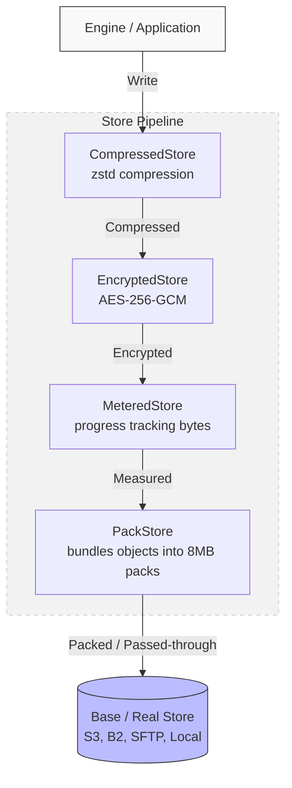

# Cloudstic — Flat Cloud Backup Specification

## Version

* Specification version: 2.0
* Date: 2026-02-21

---

## Overview

Cloudstic is a content-addressable backup system designed for flat cloud storage (Google Drive, OneDrive, S3, SFTP, local filesystem). It supports:

* **Checkpoint-only snapshots** — every snapshot is a complete view, no delta replay needed
* **Structural sharing** via a Merkle-HAMT — only changed paths are re-uploaded
* **Content deduplication** via content-defined chunking (FastCDC)
* **Immutable, content-addressed objects** — every object is keyed by its hash (HMAC-SHA256 for chunks, SHA-256 for metadata)
* **Multi-parent and duplicate-name file support** (Google Drive semantics)

---

## Architecture

### Sources (read-only data origins)

| Source            | Flag                      | Description                                      |
|-------------------|---------------------------|--------------------------------------------------|
| `local`           | `-source local`           | Local filesystem directory                       |
| `sftp`            | `-source sftp`            | Remote SFTP server                               |
| `gdrive`          | `-source gdrive`          | Google Drive full scan via OAuth2                 |
| `gdrive-changes`  | `-source gdrive-changes`  | Google Drive incremental via Changes API          |
| `onedrive`        | `-source onedrive`        | Microsoft OneDrive full scan via OAuth2           |
| `onedrive-changes`| `-source onedrive-changes`| Microsoft OneDrive incremental via delta API      |

### Stores (content-addressed object storage)

| Store   | Flag            | Description                     |
|---------|-----------------|---------------------------------|
| `local` | `-store local`  | Local directory (`./backup_store` by default) |
| `s3`    | `-store s3`     | Amazon S3 (or S3-compatible service) |
| `b2`    | `-store b2`     | Backblaze B2 bucket             |
| `sftp`  | `-store sftp`   | Remote SFTP server              |

### Store Pipeline (Chaining)

Cloudstic implements storage via a decorator pattern (store chaining). When the application writes or reads an object, the request passes through a layered sequence of wrapper stores before reaching the persistent backing store.


```mermaid
flowchart TD
    App[Engine / Application]
    
    subgraph Pipeline [Store Pipeline]
    direction TB
    Comp[CompressedStore<br>zstd compression]
    Enc[EncryptedStore<br>AES-256-GCM]
    Met[MeteredStore<br>progress tracking bytes]
    Pack[PackStore<br>bundles objects into 8MB packs]
    end
    
    Base[(Base / Real Store<br>S3, B2, SFTP, Local)]

    App -- Write --> Comp
    Comp -- Compressed --> Enc
    Enc -- Encrypted --> Met
    Met -- Measured --> Pack
    Pack -- Packed / Passed-through --> Base

    style App fill:#f9f9f9,stroke:#333
    style Base fill:#bbf,stroke:#333
    style Pipeline fill:#f2f2f2,stroke:#ccc,stroke-dasharray: 5 5
```

The pipeline from outermost (application layer) to innermost (network layer) is:

1. **Compressed Store**: Compresses outgoing objects using `zstd` and decompresses incoming objects. The encoding is recorded in a frame header (see [Compression Frame](#compression-frame)) rather than recovered by inspecting the stored bytes.
2. **Encrypted Store** *(optional)*: Encrypts the compressed data using AES-256-GCM, and decrypts/authenticates the ciphertext on read.
3. **Metered Store**: Tracks bytes written to and read from the underlying layer to precisely report progress reflecting the actual physical bytes stored/retrieved.
4. **Pack Store** *(optional)*: Intercepts small objects (like `filemeta/`, `node/`, and small manifests). Buffers them in memory and groups them into 8MB pack files (`packs/<hash>`) to drastically reduce bucket API requests and billing. Large objects bypass the buffer and pass through directly.
5. **Base / Real Store**: The raw persistent backend (e.g., `s3`, `local`, `sftp`). This layer performs the exact I/O or network requests.

**Data Flow Example (Read):**

`App ← [decompress] ← [decrypt] ← [measure] ← [extract from pack or get] ← [Base Store]`

#### Compression Frame

zstd does not shrink every input. When it cannot, the Compressed Store keeps the
object verbatim — so "compressed" is a per-object property, and the reader has to
know which it holds.

Repositories at format `2` or above record that in a header:

```text
┌──────────────────────────────────────────────┐
│ magic 0x43 0x53 0x00 0x01           4 bytes  │
│ algorithm (0x00 raw, 0x01 zstd)     1 byte   │
│ uncompressed length (big-endian)    8 bytes  │
│ payload                             …        │
└──────────────────────────────────────────────┘
```

The length field makes the frame self-checking: a payload that does not decode to
exactly that many bytes is an error, never data.

Objects without the header are read by detecting a gzip or zstd stream and
otherwise returning the bytes unchanged. That path is permanent — every
repository keeps unframed objects from before the frame existed — but it is only
a fallback, and it is the reason the frame exists. Sniffing cannot distinguish
"this store compressed the object" from "the user's file begins with those
bytes", so backing up an already-compressed `.gz` or `.zst` file yielded its
*decompressed* contents on restore.

Writers frame only once the repository records format `2`, because the format
stamp is applied after a mutation completes: a build predating the frame reads
one as opaque bytes rather than refusing it, so a repository still recording
format `1` must not be handed framed objects. See
[compatibility.md](compatibility.md).

### Commands

| Command            | Description                                              |
|--------------------|----------------------------------------------------------|
| `init`             | Initialize a new repository with encryption key slots    |
| `backup`           | Scan a source, upload changed files, create a snapshot   |
| `restore`          | Export a snapshot's file tree as a ZIP archive            |
| `list`             | Print a table of all snapshots                           |
| `ls`               | Print the file tree of a specific snapshot               |
| `diff`             | Compare two snapshots and show file-level changes        |
| `forget`           | Remove a snapshot (and optionally prune afterwards)      |
| `prune`            | Mark-and-sweep garbage collection of unreachable objects |
| `break-lock`       | Force-remove a stale repository lock                     |
| `key list`         | List all encryption key slots in the repository          |
| `key passwd`       | Change (rotate) the repository password                  |
| `key add-recovery` | Add a BIP39 recovery key slot to the repository          |

---

## Object Types

All objects are stored under a flat key namespace of the form `<type>/<hash>`.

### 1. Chunk

* Raw file data, zstd-compressed.
* Object key: `chunk/<hmac_sha256>` (HMAC-SHA256 keyed by the dedup key when
  encryption is enabled, plain SHA-256 otherwise)
* **Format:** Raw binary, not JSON-wrapped. Written inside a
  [compression frame](#compression-frame) at format `2` and above, which records
  whether the payload is a zstd stream or the chunk verbatim.
* Produced by **FastCDC** content-defined chunking:

| Parameter | Value    |
|-----------|----------|
| Min size  | 512 KiB  |
| Avg size  | 1 MiB    |
| Max size  | 8 MiB    |

* The final chunk of a file may be smaller than the minimum.
* Deduplicated by hash of the original uncompressed data (HMAC-keyed when
  encrypted, preventing the storage provider from confirming file contents).

### 2. Content

* References the ordered list of chunks that make up a file's content.
* Object key: `content/<content_ref>` (where `content_ref` is an HMAC of the
  raw content hash when encryption is enabled, or the plain SHA-256 otherwise)

```json
{
  "type": "content",
  "size": 10485760,
  "chunks": [
    "chunk/<sha256>",
    "chunk/<sha256>"
  ]
}
```

* `data_inline_b64` (optional): base64-encoded bytes for very small files, in place of `chunks`.

### 3. File Metadata (FileMeta)

* Immutable metadata about a file or folder.
* Object key: `filemeta/<sha256-of-serialized-json>`

```json
{
  "version": 1,
  "fileId": "abc123",
  "name": "invoice.pdf",
  "type": "file",
  "parents": ["filemeta/<sha256>"],
  "content_hash": "<sha256-of-raw-file-content>",
  "content_ref": "<hmac-sha256-of-content_hash>",
  "size": 21733,
  "mtime": 1710000000,
  "owner": "user@example.com",
  "extra": { "mimeType": "application/pdf" },
  "mode": 33261,
  "uid": 501,
  "gid": 20,
  "btime": 1710000000,
  "flags": 0,
  "xattrs": { "user.tag": "cHJvamVjdA==" }
}
```

| Field          | Description                                                         |
|----------------|---------------------------------------------------------------------|
| `fileId`       | Source-specific unique identifier (Google Drive ID, relative path)   |
| `type`         | `"file"` or `"folder"`                                              |
| `parents`      | List of `filemeta/<sha256>` refs pointing to parent metadata objects |
| `content_hash` | SHA-256 of the raw file content |
| `content_ref`  | Opaque content reference used as `content/<content_ref>` key; HMAC of `content_hash` for encrypted repos, plain `content_hash` for unencrypted repos |
| `paths`        | Optional legacy compatibility field; new snapshots typically omit it and derive display paths from `parents` + `name` |
| `extra`        | Source-specific metadata (e.g. MIME type)                           |
| `mode`         | POSIX file mode bits (e.g. `0755` = `493`). Omitted if zero.       |
| `uid`          | Numeric owner user ID. Omitted if zero.                             |
| `gid`          | Numeric owner group ID. Omitted if zero.                            |
| `btime`        | File creation (birth) time as Unix epoch seconds. Omitted if zero.  |
| `flags`        | OS-specific file flags (macOS `UF_*`/`SF_*`, Linux `FS_*_FL`). Omitted if zero. |
| `xattrs`       | Extended attributes as `name → base64(value)` map. Omitted if empty.|

* `fileId` is **the HAMT key**.
* Folders have an empty `content_hash`, `content_ref`, and `size` of 0.
* Deduplicated by SHA-256 of the canonical JSON representation.

### 4. HAMT Node

Merkle-HAMT nodes map file IDs to their `filemeta/<sha256>` references.

Object key: `node/<sha256-of-serialized-json>`

#### Internal Node

```json
{
  "type": "internal",
  "bitmap": 2348810305,
  "children": ["node/<sha256>", "node/<sha256>"]
}
```

* 5 bits consumed per level → 32-way branching.
* `bitmap` encodes which child slots are populated (popcount-compressed).

#### Leaf Node

```json
{
  "type": "leaf",
  "entries": [
    { "key": "<fileId>", "filemeta": "filemeta/<sha256>" }
  ]
}
```

* Maximum 32 entries per leaf.
* Entries are sorted by key for deterministic hashing.

#### Canonical shape

A tree's shape is a function of its contents alone: an internal node exists only
where more than 32 entries live beneath it. Two trees holding the same entries
therefore have the same root, whatever sequence of inserts and deletes produced
them.

Insertion maintains this by splitting a leaf exactly when it would exceed 32.
Deletion maintains it by re-merging a subtree back into one leaf once it holds
32 or fewer entries. Without that second rule a subtree that split under load
and later shrank would stay split, and equal content would hash differently
depending on its history — which costs node deduplication between repositories
and leaves shrinking trees carrying nodes they no longer need.

Older builds do not enforce the deletion rule, so a repository they wrote may
contain trees that are not canonical. Those remain valid and readable: a leaf
may appear at any level, which is already the case for any tree small enough to
fit in one. Such a tree becomes canonical the next time a deletion passes
through it.

### 5. Snapshot

* A complete checkpoint pointing to a HAMT root.
* Object key: `snapshot/<sha256-of-serialized-json>`

```json
{
  "version": 1,
  "created": "2025-12-01T12:00:00Z",
  "root": "node/<sha256>",
  "seq": 42,
  "source": {
    "type": "gdrive",
    "account": "user@gmail.com",
    "path": "my-drive://",
    "fs_type": "google-drive"
  },
  "meta": {
    "generator": "cloudstic-cli"
  },
  "tags": ["daily", "important"],
  "change_token": "12345",
  "exclude_hash": "d4c3b2a1..."
}
```

| Field          | Description                                                          |
|----------------|----------------------------------------------------------------------|
| `seq`          | Monotonically increasing sequence number                             |
| `source`       | Origin of the backup (type, account, path, fs_type) — used for retention grouping |
| `meta`         | Free-form key-value metadata (generator, etc.)                       |
| `tags`         | User-defined labels for retention policies                           |
| `change_token` | Opaque token for incremental sources (omitted when not applicable)   |
| `exclude_hash` | SHA-256 of the concatenated exclude patterns used for this snapshot  |

* Every snapshot is a **complete checkpoint** — no delta replay needed.
* Structural sharing via the HAMT minimises the number of new nodes.

#### Change tokens

Incremental sources (`gdrive-changes`) record an opaque `change_token` in each snapshot. On the next backup, the engine reads the token from the previous snapshot and passes it to the source, which returns only the files that changed since that token. If no previous token exists (first backup or after switching from a full-scan source), the source performs a full scan and saves the initial token.

The token format is source-specific:

| Source              | Token type                                    |
|---------------------|-----------------------------------------------|
| `gdrive-changes`    | Google Drive Changes API start page token     |
| `onedrive-changes`  | Microsoft OneDrive delta API next-link/token  |

### 6. Blob (`blob/`, format v3 only)

A packed run of file bodies, so that a repository of small files does not mint
a stored object per file. Written by format-v3 repositories only; a v2
repository stores a body as a `content/` object instead.

* Object key: `blob/<sha256>`, over the members' **digests in order** — a
  manifest of what the blob holds rather than of the bytes it stores. Hashing
  the concatenated bodies would not determine where one member ends and the
  next begins, and an empty file makes that collide without contrivance.
* Layout: `member_1 || ... || member_n || index || uint32 index length`.
* Each member is compressed and sealed **independently**, so a reader that
  wants one body fetches its byte range and decrypts exactly it. The member's
  compression codec travels inside its sealed bytes, which is what makes a
  ranged read self-describing.
* Members are keyed from the member's own plaintext hash — the value the
  entry's metadata already records — with the containing blob's ref as
  additional authenticated data. The key binds the member, the AAD binds the
  container.
* The trailing index lists each member's offset, length and plaintext hash and
  is itself sealed, so a blob is self-describing and the repository needs no
  blob catalog.
* `blob/` is **not** in `core.SelfAddressedPrefixes`: it is the one namespace
  whose plaintext no reader ever assembles, so its ref cannot be verified by
  hashing what was fetched.
* Blobs bypass the store chain's compression and encryption, carrying their own
  per member. They are written below both, the position `PackStore`'s catalog
  and footers occupy.

A leaf entry referencing a blob carries `(blob ref, offset, length, stored
total)`. The stored total is repeated in every referencing entry so that
consolidation has a denominator without a lookup or a second index.

Blobs are immutable and are never repacked. A blob that has become mostly
garbage is retired by the **next** backup, which rewrites its still-live
bodies into the blobs it is already writing and repoints those entries; older
snapshots keep naming the original blob, which prune collects once no retained
snapshot needs it. Consolidation changes no object format and produces
ordinary blobs — a build that knows nothing about it reads a consolidated
repository exactly as it reads any other. See "Blob consolidation" in
`docs/storage-model.md`.

### 7. Packfiles (`packs/` and `index/packs`)

To avoid issuing hundreds of thousands of S3 `PUT` and `GET` requests for tiny metadata objects, the storage layer implements a stateless PackStore.

* Only content-addressed prefixes are eligible: `filemeta/`, `node/`, `snapshot/`, `chunk/`, and `content/`. Mutable keys such as `index/latest` are never packed.
* Small objects (< 512KB) are buffered in memory and flushed as aggregated 8MB `packs/<hash>` files.
* The `index/packs` catalog is then updated to record the exact byte offset and length of each logical object within its packfile.
* When reading, the entire 8MB packfile is fetched and cached in an LRU, meaning thousands of subsequent metadata reads take 0 network requests.

#### Packfile layout

Each packfile ends with a self-describing footer, so its contents can be located without the catalog:

```text
┌──────────────────────────────────────────────┐
│ object bytes (concatenated)                   │
├──────────────────────────────────────────────┤
│ footer payload (JSON)                         │
├──────────────────────────────────────────────┤
│ footer length   uint32 big-endian   4 bytes   │
│ format version  uint8               1 byte    │
│ magic "CSPACK"                      6 bytes   │
└──────────────────────────────────────────────┘
```

The footer payload lists every object in the pack:

```json
{ "v": 1, "entries": [ { "k": "filemeta/<hash>", "o": 0, "l": 412 } ] }
```

Entries are sorted by key, so an identical set of objects produces a byte-identical packfile and the content-addressed packfile name stays reproducible. The packfile hash covers the footer.

Object bytes keep their position and meaning, so a reader that resolves objects by explicit offset and length is unaffected by the footer's presence. Packfiles written before RFC 0018 have no footer and remain readable through the catalog.

### 8. Index

#### index/latest

A mutable pointer to the most recent snapshot:

```json
{
  "latest_snapshot": "snapshot/<sha256>",
  "seq": 42
}
```

#### index/snapshots

A catalog of lightweight snapshot summaries used to avoid fetching each full snapshot object individually. Stored as a JSON array of `SnapshotSummary` objects (same fields as `Snapshot` minus the HAMT root detail). Self-heals via reconciliation with `LIST snapshot/` on load — if the catalog is missing or stale it is rebuilt automatically.

#### index/packs

When packfiles are enabled, a JSON object mapping logical object keys to the packfile, byte offset, and length where their bytes actually live:

```json
{
  "filemeta/<hash>": { "p": "packs/<hash>", "o": 0, "l": 412 }
}
```

A packed object has no object of its own at its logical key, so the key is resolvable only through this catalog or through the footer of the packfile holding it.

The catalog is a **cache**, not the source of truth. Packfiles written since RFC 0018 carry a self-describing footer (see above), so a missing catalog is rebuilt by listing `packs/` and reading footers — the same relationship `index/snapshots` has with `LIST snapshot/`. Recovery is automatic: when `index/packs` is absent but packfiles exist, `PackStore` reconstructs it before serving any read.

Two caveats remain:

* **Packfiles written before footers existed cannot be recovered this way.** Their offsets genuinely exist nowhere but the catalog. When a rebuild encounters one, it reports how many packs are unrecoverable rather than silently returning a partial catalog. A `repack` rewrites such packs with footers.
* **An unreadable catalog is not the same as a missing one.** A read failure fails the operation that needed it rather than degrading to an empty catalog, because an empty catalog is indistinguishable from "nothing is packed" and would make `prune` treat every packed object as garbage.

---

## Backup Flow

1. **Load previous state**: read `index/latest` → snapshot → HAMT root.
2. **Scan**: walk the source; for each file:
   * Look up the file ID in the old HAMT.
   * Fast-check metadata (name, size, mtime, type, parents). If identical and the source doesn't provide a content hash, carry the old hash forward (avoids false-positive diffs).
   * Unchanged files are re-inserted into the new HAMT by reference.
   * Changed or new files are queued for upload.
3. **Upload**: process queued files with concurrent workers:
   * Stream → FastCDC split → HMAC-SHA256 (keyed by dedup key, or plain SHA-256 if unencrypted) → zstd → store as `chunk/<hash>` (dedup by Exists check).
   * Create `content/<content-hash>` object.
   * Create `filemeta/<hash>` object referencing the content.
   * Insert into the new HAMT.
4. **Persist**: create `snapshot/<hash>`, update `index/latest`. (Metadata is bundled into `packs/` automatically by the store layer).
5. **Flush HAMT**: only reachable new nodes are written to the persistent store (BFS from root through the transactional cache).

---

## Restore Flow

1. Resolve snapshot (by ID or `latest`).
2. Walk the HAMT to collect all `filemeta` entries.
3. **Topological sort** ensures parent directories are created before their children.
4. **Path building**: walk the parent chain of each entry to reconstruct the full relative path.
5. Write entries to a ZIP archive:
   * Folders: directory entries with stored `mtime`.
   * Files: load `content/<hash>`, fetch and decompress each chunk, write to the ZIP stream.
6. Output is always a ZIP archive (used by both CLI and web).

---

## Diff

The `diff` command leverages the HAMT's `Diff(root1, root2)` primitive, which performs a parallel traversal of two HAMT roots and yields entries that differ (added, removed, or modified by value ref).

---

## Forget & Prune

**Forget** removes a snapshot:

1. Delete the `snapshot/<hash>` object.
2. If the snapshot was `latest`, elect the highest-seq remaining snapshot as the new `index/latest`.
3. Optionally run prune.

**Prune** (mark-and-sweep GC):

1. **Mark**: list `snapshot/` to find all live snapshots, then walk each snapshot → HAMT nodes → filemeta → content → chunks. Collect all reachable keys.
2. **Sweep**: list all keys under `chunk/`, `content/`, `filemeta/`, `node/`, and `snapshot/`. Delete any key not in the reachable set. Objects inside packfiles are removed from the pack catalog.
3. **Repack**: when packfiles are enabled, fragmented packs (more than 30% wasted space) are repacked — live objects are extracted, re-bundled into new packs, and the old packs are deleted.

---

## Repository Locking

Cloudstic uses a two-tier distributed lock stored inside the repository itself (under `index/`) to prevent concurrent writes from corrupting the repository.

### Lock types

| Type | Key | Behaviour |
|---|---|---|
| **Shared** | `index/lock.shared/<timestamp>` | Multiple shared locks can coexist. Used by read-write operations that are safe to run in parallel with each other. |
| **Exclusive** | `index/lock.exclusive` | Only one exclusive lock can exist. Blocked by any active shared lock; blocks all new shared and exclusive locks. |

### Which operation holds which lock

| Command | Lock type | Acquired | Released |
|---|---|---|---|
| `backup` | Shared | At the start of `BackupManager.Run`, after dry-run check | When `Run` returns (success or error) |
| `restore` | Shared | At the start of `RestoreManager.Run`, always (dry-run still acquires) | When `Run` returns |
| `prune` | Exclusive | At the start of `PruneManager.Run`, after dry-run check | When `Run` returns |
| `forget` | None | — | — |

`-dry-run` on `backup` skips lock acquisition entirely (no writes are made). `prune -dry-run` also skips the exclusive lock.

### Lock payload

Each lock object is a JSON document:

```json
{
  "operation":   "backup",
  "holder":      "hostname (pid 12345)",
  "acquired_at": "2026-03-07T09:00:00.000000000Z",
  "expires_at":  "2026-03-07T09:01:00.000000000Z",
  "is_shared":   true
}
```

`holder` is `"<hostname> (pid <pid>)"` of the process that acquired the lock.

### TTL and automatic refresh

* **TTL:** 1 minute from acquisition.
* **Refresh:** A background goroutine rewrites the lock every 30 seconds, extending `expires_at` by another minute. This keeps the TTL short for fast crash recovery while supporting arbitrarily long operations.
* **Crash recovery:** If the process dies without calling `Release`, the lock expires after at most 1 minute. Any subsequent operation will see an expired `expires_at` and treat the lock as stale, overriding it.
* **Refresh failure:** If the backing store becomes unreachable, the refresh goroutine gives up after 3 consecutive failures, allowing the TTL to expire naturally.

### TOCTOU mitigation

Object stores without atomic conditional writes (S3, B2, SFTP) have an inherent check-then-set race. After writing the exclusive lock, the engine immediately re-reads it and verifies `holder + acquired_at` still match. If another process won the race, the acquire call returns an error.

For shared locks, the engine writes its shared lock entry and then re-checks the exclusive lock path. If an exclusive lock appeared concurrently, the shared lock entry is deleted and the call returns an error.

### Stale lock recovery

A lock is stale when its `expires_at` is in the past. Stale locks are ignored automatically — the next operation acquires normally without any manual intervention.

If a lock is active but the holder has crashed (network partition, kill signal before TTL expires), use `break-lock` to force-remove all locks immediately.

### break-lock

`break-lock` unconditionally deletes `index/lock.exclusive` and all `index/lock.shared/<timestamp>` entries regardless of TTL or holder. It prints each removed lock's metadata. Only use it when you are certain no operation is actively running against the repository.

---

## HAMT Construction

The HAMT is a **Merkle Hash Array Mapped Trie** with 5 bits per level (32-way branching). Operations are exposed through the `Tree` type:

| Method    | Description                                         |
|-----------|-----------------------------------------------------|
| `Insert`  | Insert or update a key-value pair, return new root  |
| `Lookup`  | Look up a key, return its value ref                 |
| `Walk`    | Iterate all key-value pairs in the trie             |
| `Diff`    | Yield entries that differ between two roots          |
| `NodeRefs`| Yield all node refs reachable from a root            |

All mutations are purely functional — `Insert` returns a new root reference while the old root remains valid. This enables structural sharing between snapshots.

A `Txn` holds new nodes in memory during a backup and writes nothing until `Commit`, which serializes only the dirty spine reachable from the final root — so nodes superseded mid-transaction are never uploaded. See `docs/caching.md` for how this relates to the in-process caches.

### Affinity Model (HAMTv2)

Implemented in [PR #61](https://github.com/cloudstic/cloudstic-cli/pull/61).

By default, `SHA-256(fileID)` produces uniformly distributed routing keys. Files sharing the same parent directory scatter across all 32 top-level trie buckets, causing `O(N · depth)` intermediate node rewrites on every incremental backup of a directory with `N` changed files.

The affinity model biases routing so that siblings share a common subtree:

```
AffinityKey(parentID, fileID) = SHA256(parentID)[:4] + SHA256(fileID)[4:]
```

The first 4 hex characters (16 bits) are derived from the parent directory ID, pinning all siblings to the same top-3 trie levels. The remaining 28 hex characters come from the file's own hash. Total key length is unchanged (32 hex chars), so the routing machinery is unaffected.

**Impact:** incremental backups of a flat directory rewrite `O(maxDepth)` nodes instead of `O(N · maxDepth)`.

New snapshots are tagged `hamt_version: 2`. Snapshots without this field default to version 1 (legacy SHA-256 keys) and remain fully readable.

---

## Structural Sharing

```
     root_old          root_new
      /  |  \           /  |  \
     A   B   C         A   B'  C     ← only B' is new
         |                 |
        ...              (modified)
```

* Only nodes along the path of a modified file ID change.
* Metadata-only updates (name, parent) replace `filemeta/<hash>` and the corresponding leaf + ancestors.
* Content updates replace `content/<hash>`, its chunks, the filemeta, and the HAMT path.
* All other nodes are reused by reference.

---

## Tunable Parameters

| Parameter         | Default      | Notes                              |
|-------------------|--------------|------------------------------------|
| Chunk min size    | 512 KiB      | FastCDC minimum                    |
| Chunk avg size    | 1 MiB        | FastCDC average                    |
| Chunk max size    | 8 MiB        | FastCDC maximum                    |
| Leaf size         | 32 entries   | Max entries per HAMT leaf          |
| HAMT bits/level   | 5 bits       | 32-way branching                   |
| Upload workers    | 10           | Concurrent file upload goroutines  |
| HAMT flush workers| 20           | Concurrent node flush goroutines   |

---

## Environment Variables

| Variable                         | Used by   | Description                          |
|----------------------------------|-----------|--------------------------------------|
| `GOOGLE_APPLICATION_CREDENTIALS` | `gdrive`  | Path to OAuth client credentials     |
| `ONEDRIVE_CLIENT_ID`            | `onedrive`| Azure app client ID                  |
| `ONEDRIVE_CLIENT_SECRET`        | `onedrive`| Azure app client secret              |
| `ONEDRIVE_TOKEN_FILE`           | `onedrive`| Path to cached OAuth token (default: `onedrive_token.json`) |
| `B2_KEY_ID`                     | `b2`      | Backblaze B2 application key ID      |
| `B2_APP_KEY`                    | `b2`      | Backblaze B2 application key         |
